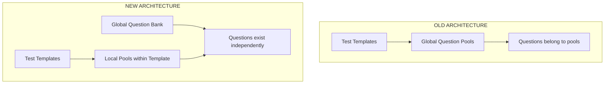

# UI Changes Summary - Question Pool Architecture Update

## Overview
This document summarizes the UI changes required to support the new question pool architecture where pools are local to test templates and questions live in a global bank.

## Architecture Change



## Key Conceptual Changes

| Aspect | Before | After |
|--------|--------|-------|
| **Question Storage** | Questions belonged to global pools | Questions exist in a global bank independently |
| **Pool Scope** | Pools were global entities | Pools are local to each test template |
| **Question Assignment** | Questions assigned to pools globally | Questions assigned from bank to pools within templates |
| **Pool Management** | Separate pool management screens | Pool management integrated into template editor |
| **Question Reusability** | Limited by pool structure | Same question can be in multiple templates, different pools |
| **Within Template** | N/A | Question can only be in one pool per template |

## Screen-by-Screen Changes

### ❌ Removed Screens

#### Screen 6: Question Pools List Page
- **Why removed:** Pools are no longer global entities that exist independently
- **Replaced by:** Pool management is now part of the Template Editor

#### Screen 7: Question Pool Management Page
- **Why removed:** Questions are no longer managed at the pool level
- **Replaced by:** Question Bank Management + Template Editor pool assignment

### ✅ Added Screens

#### Screen 6 (NEW): Question Bank List Page
**Purpose:** Central repository for all questions

**Key Features:**
- Display all questions in the examiner's global bank
- Questions shown with preview, points, number of answers
- Create, edit, delete operations
- Search and filter capabilities
- Delete protection if question is used in any template
- No pool organization at this level

**User Story:** US-004

#### Screen 7 (NEW): Question Management Page/Modal
**Purpose:** Create and edit individual questions

**Key Features:**
- Question content input
- 2-6 answer options (dynamic)
- Correct answer selection
- Points assignment
- Validation (min 2 answers, exactly 1 correct)
- Warning when editing questions used in templates

**User Story:** US-004

### 🔄 Modified Screens

#### Screen 5: Dashboard / Main Panel
**Changes:**
- Navigation item: "Question Pools" → "Question Bank"
- Links to Question Bank List instead of Question Pools List

#### Screen 8: Test Templates List Page
**Changes:**
- Template cards now show:
  - Number of **local pools** (not global pools)
  - Total questions assigned across pools
- Editing opens new Template Editor with integrated pool management

#### Screen 9 (MAJOR UPDATE): Test Template Editor Page
**Previous Functionality:**
- Select questions from existing global pools
- Define how many questions to draw from each pool

**New Functionality:**
This becomes a comprehensive editor with three main sections:

##### 1. Template Basic Info
- Template name
- Description (optional)

##### 2. Local Pools Management
**Features:**
- Create new pools within this template
- Pool name (unique within template)
- Set number of questions to draw from each pool
- Delete pools (questions become unassigned in template)
- Validation: draw count ≤ available questions

##### 3. Question Assignment
**Features:**
- Browse questions from global bank
- Assign questions to local pools
- Visual indicators for current assignments
- Move questions between pools (removes from first, adds to second)
- Constraint enforcement: one pool per question per template
- Search and filter questions

**Key Validations:**
- Template must have ≥1 pool
- Each question can be in max 1 pool within this template
- Cannot draw more questions than available in pool

**User Stories:** US-005, US-006

## User Flow Comparison

### OLD: Creating a Test Template


### NEW: Creating a Test Template


## Data Model Changes

### Question Assignment

**Before:**
```
Question → belongs to → Global Pool → used in → Template
```

**After:**
```
Question → exists in → Global Bank
Template → has → Local Pools → assigned from → Global Bank
```

### Question Reusability

**Before:**
- Question in Pool A
- Template 1 uses Pool A
- Template 2 uses Pool A
- Both templates get same questions from Pool A

**After:**
- Question exists in Bank
- Template 1: Question assigned to "Easy Pool"
- Template 2: Question assigned to "Advanced Pool"
- Same question, different contexts

### Within-Template Constraint

**New Rule:** In Template X, Question Q can only be in one pool

**Example:**
```
Template "Math Exam"
├── Pool "Algebra" 
│   └── Question #42 ✓
├── Pool "Geometry"
│   └── Question #42 ✗ (already in Algebra pool)
└── Pool "Calculus"
```

## Implementation Priorities

### Phase 1: Core Infrastructure
1. Create Question Bank List Page
2. Create Question Management Page/Modal
3. Update Dashboard navigation

### Phase 2: Template Editor Overhaul
1. Add Local Pools Management section
2. Implement Question Assignment interface
3. Add validation logic for pool constraints
4. Implement move-between-pools functionality

### Phase 3: Data Migration & Cleanup
1. Migrate existing pool data to new structure
2. Remove old Question Pools pages
3. Update all navigation and links

## UX Considerations

### Advantages of New Approach
- ✅ Clearer separation: questions vs. organization
- ✅ More flexible question reuse across templates
- ✅ Easier to manage large question banks
- ✅ Pool organization specific to each template's needs
- ✅ Prevents accidental question duplication within a template

### Potential Challenges
- ⚠️ Template editor becomes more complex (3 sections vs. 1)
- ⚠️ Users need to understand bank → pool → template flow
- ⚠️ More clicks to create a complete template

### Mitigation Strategies
- Use clear visual hierarchy in Template Editor
- Provide inline help/tooltips explaining the flow
- Show assignment status clearly (assigned/unassigned)
- Implement drag-and-drop for question assignment
- Add bulk assignment features
- Provide template creation wizard for first-time users

## Testing Checklist

- [ ] Can create questions in global bank
- [ ] Can edit questions in bank (changes reflect in templates)
- [ ] Cannot delete questions used in templates
- [ ] Can create template with local pools
- [ ] Can assign questions from bank to pools
- [ ] Cannot assign same question to multiple pools in one template
- [ ] Can assign same question to different pools in different templates
- [ ] Can move question between pools within template
- [ ] Validation prevents draw count > available questions
- [ ] Deleting pool makes questions unassigned in that template
- [ ] Dashboard navigation works correctly
- [ ] Old Question Pools pages are removed/inaccessible
